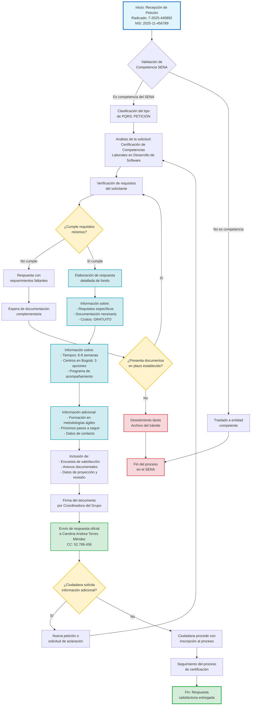

# Diagrama de Flujo - Proceso de Respuesta PQRS
## Certificación de Competencias Laborales en Desarrollo de Software

## Descripción del Proceso

### Etapas Principales:

1. **Recepción y Validación**: La petición es recibida y validada para confirmar que es competencia del SENA.

2. **Análisis de Solicitud**: Se clasifica como PETICIÓN y se analiza el requerimiento específico sobre certificación de competencias laborales en desarrollo de software.

3. **Verificación de Requisitos**: Se valida que la solicitante cumpla con los requisitos mínimos (experiencia de 3 años como desarrolladora).

4. **Elaboración de Respuesta Completa**: Se estructura una respuesta detallada que incluye:
   - Requisitos específicos para la certificación
   - Documentación necesaria
   - Información sobre costos (gratuito)
   - Tiempos estimados del proceso (6-8 semanas)
   - Centros disponibles en Bogotá
   - Programa de acompañamiento sin costo
   - Oferta de formación complementaria en metodologías ágiles

5. **Formalización**: Se incluyen anexos, encuesta de satisfacción y firma de la autoridad competente.

6. **Envío y Seguimiento**: Se entrega la respuesta oficial y se realiza seguimiento para verificar si requiere información adicional o procede con el trámite.

### Códigos de Color:

- **Azul claro**: Inicio del proceso
- **Verde**: Finalización exitosa
- **Rojo**: Finalización por desistimiento o traslado
- **Amarillo**: Puntos de decisión
- **Cyan**: Información detallada proporcionada

---

**Tiempo de respuesta:** 15 días hábiles desde la recepción  
**Resultado:** Respuesta satisfactoria de fondo con información completa y detallada
