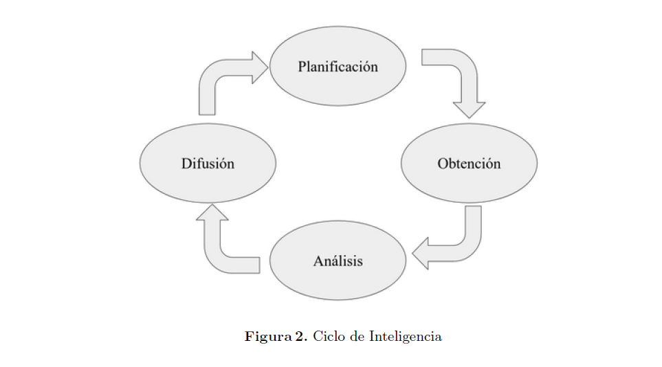
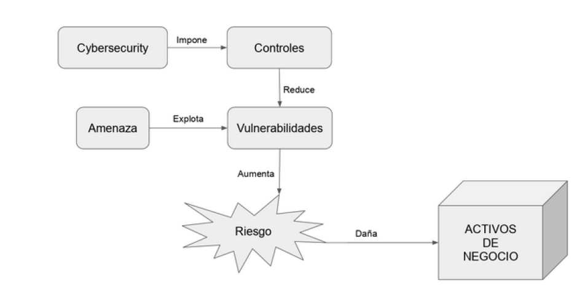
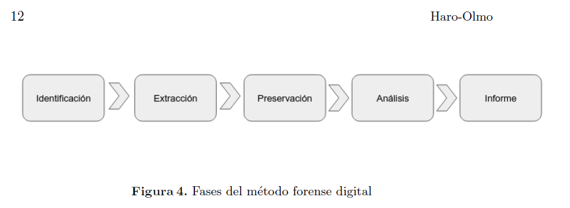

Crimen, cibercrimen y an´alisis forense inform´atico

Francisco Jos´e de Haro Olmo
I.E.S. Celia Vin˜as
franciscoj.haro.edu@juntadeandalucia.es

Resumen Tras la publicacio´n en el BOE1 del Real Decreto 479/2020, de 7 de abril, por el que se establece el Curso de Especializacio´n en Ciberseguridad en entornos de las tecnolog´ıas de la informacio´n con una carga horaria de 720 horas, 43 cr´editos ECTS y que comienza a impartirse el mes de noviembre del curso 2020-2021, desarrollando los contenidos propuestos para el mo´dulo profesional de Ana´lisis Forense Informa´tico, con un total de 120 horas. Estos contenidos abordan la metodolog´ıa del ana´lisis forense digital en distintos tipos de plataformas y dispositivos: sistemas informa´ticos, Cloud e IoT. Finalmente se presenta la estructura de un informe forense, as´ı como las consideraciones legales y normas aplicables que se ha de tener en cuenta. Este documento pretende ofrecer una visio´n de los elementos que intervienen en cibercrimen y del papel que desempen˜a el ana´lisis forense digital en la investigacio´n de incidentes de ciberseguridad y cibercrimen, destacando la importancia y alcance del informe pericial.
Keywords: Ciberseguridad · Ana´lisis Forense · Especializacio´n · For-macio´n Profesional · Ma´ster

Fecha de publicacio´n: 25/11/2020
https://iescelia.org/ciberseguridad/ceceti-afi-00

1.	Introduccio´n
Antes de nada deber´ıamos introducir algunos conceptos que nos acompan˜ar´an en el resto del tema y que fundamenta nuestro conocimiento en la materia.
Crimen: Delito grave o acto que es penalizado por la sociedad. La diferencia entre crimen y delito, es que el delito es determinado por las leyes de un deter-minado Estado, mientras que el crimen lo determina la sociedad. Tambi´en se diferencian por su magnitud, de forma que un delito grave se considera crimen.
Delincuente: persona que comete un delito, especialmente el que lo hace habitualmente.

1 Bolet´ın Oficial del Estado
 

Ciberdelincuente: el que hace uso de los medios tecnol´ogicos para cometer un delito. Podemos hablar de tipos de ciberdelincuentes.
Trabajador descontento que lleva a cabo un ataque desde dentro de la em-presa.
Hacktivista, motivados por alguna ideolog´ıa emplean sus conocimientos en llevar a cabo ataques a sistemas inform´aticos de objetivos previamente selec-cionados. Hacker, conocido como pirata inform´atico. Aqu´ı podemos hablar de hacker de sombrero negro y hacker de sombrero blanco (´etico).
Ciber-terroristas, son grupos organizados que emplean la tecnolog´ıa para crear miedo entre una poblaci´on. Rara vez se trata de un u´nico individuo.
Cibercrimen: delito grave que se realiza a nivel inform´atico. Es el uso de herramientas inform´aticas para realizar pr´acticas ilegales como pueden ser por-nograf´ıa infantil, violaci´on de privacidad, difamaciones.
Se dividen en dos categor´ıas: - Actividad criminal, cuyo prop´osito son los propios sistemas inform´aticos. - Actividad delictiva en la que se utilizan dispo-sitivos electr´onicos o inform´aticos para cometer otros delitos. Tecnolog´ıa como instrumento.
Algunos tipos de cibercrimen:
 	Fraude por correo electr´onico y en Internet.
 	Fraude de datos personales (robo y uso indebido de informaci´on personal).
 	Robo de datos financieros o de tarjetas bancarias.
 	Robo y venta de datos corporativos.
 	Chantaje cibern´etico (exigiendo dinero para evitar los ciberataques).
 	Ataques de programas de extorsi´on (tipo de chantaje cibern´etico).
 	Ciberespionaje.
 	Acceso il´ıcito a sistemas inform´aticos.
 	Interceptaci´on de datos inform´aticos (MiTM).
 	Falsificaci´on documental.
 	Descubrimiento y revelaci´on de secretos.
 	Amenazas y coacciones.
 	Suplantaci´on de identidad.
 	Dan˜os y sabotaje inform´atico.
 	Delitos contra la propiedad intelectual.
 	Delitos contra la intimidad y acoso
Ciberseguridad: es la disciplina que aplica los mecanismos necesarios para proteger un sistema inform´atico. En ingl´es, el t´ermino “cybersecurity” hace re-ferencia a proteger la informaci´on que hay en un sistema inform´atico as´ı como las formas en que se comunica, de forma que se preserve la confidencialidad, in-tegridad y disponibilidad. Sin embargo, el t´ermino “cybersafety” hace referencia a la protecci´on de las personas en el uso de la tecnolog´ıa, que no se pueda llegar a causar un dan˜o personal, aqu´ı se usa la tecnolog´ıa como instrumento para dan˜ar a las personas y hay que proteger ante esta posibilidad. La formaci´on de los usuarios suele ser una buena opci´on para evitar, en la medida de lo posible los efectos de la ingenier´ıa social en la seguridad de las personas (Ghafir et al, 2018).
 

Forense: relacionado con la justicia. De aqu´ı la importancia de este t´ermino y la seriedad con la que se requiere que sea tratado. El origen del t´ermino fo-rense, o sea la etimolog´ıa de la palabra, procede de “forum”, que era la plaza o espacio pu´blico de una ciudad donde se llevaban a cabo las intervenciones de los tribunales de justicia. As´ı un m´edico forense determina los aspectos legales de las lesiones que observa en una v´ıctima, pudiendo establecer una conexi´on con el grado de responsabilidad demostrado por las evidencias que este encuentre, adem´as de poder determinar las circunstancias en que se produjo un determinado delito.
Analista Forense Inform´atico: se trata de un experto en inform´atica con una formaci´on espec´ıfica que lleva a cabo la investigaci´on de los dispositivos electr´onicos que han participado en la comisi´on de un delito, con el fin de obtener la informaci´on conducente a esclarecer las circunstancias en las que se cometi´o, identificar al autor y determinar el grado de responsabilidad. Esta investigaci´on finaliza con la confecci´on de un informe pericial que arroja las conclusiones tras el an´alisis de la informaci´on obtenida mediante un m´etodo cient´ıfico que desemboca en unas conclusiones.

eje_1/img/lectura2_1.png
Figura 1. Fundamentos de ciberseguridad

1.1.	La investigaci´on del delito y el ciberdelito.
En la investigaci´on de un delito intervienen los grupos especializados en in-vestigaci´on t´ecnico policial para llevar a cabo lo que comu´nmente se conoce como “inspecci´on ocular”, adquisici´on de evidencias o pruebas sobre el escenario del
 

crimen, para posteriormente en un laboratorio. En la investigaci´on de un crimen tradicional se hace uso de disciplinas como la criminolog´ıa (Paz Velasco, 2918; Soto Castro, 2017; Serrano Maillo, 2017)) y la criminal´ıstica (Bosquet Pastor, 2015), en un cibercrimen se ponen en juego otros conocimientos del ´ambito tec-nol´ogico. En el escenario del crimen se etiquetan todas las pruebas y fotograf´ıan en la forma en que fueron encontradas a la vez que se recoge toda la informa-ci´on posible in situ y se etiqueta convenientemente para asegurar la cadena de custodia.. Aquellas evidencias que no se pueden analizar en profundidad en el escenario del crimen, se trasladan a un laboratorio, donde con el instrumental adecuado se puede realizar un an´alisis en profundidad. La investigaci´on t´ecnico policial termina con la realizaci´on del informe pericial, en el que se hace constar las pruebas obtenidas, la informaci´on que se ha conseguido averiguar a trav´es de ellas, los m´etodos empleados y unas conclusiones que se derivan de la investiga-ci´on desarrollada . Estas unidades de investigaci´on, en Espan˜a, la llevan a cabo por parte de la Polic´ıa Nacional, el grupo de Polic´ıa Cient´ıfica, y por parte de la Guardia Civil, el grupo de Criminal´ıstica. Pero cuando se trata de delitos donde interviene la tecnolog´ıa en alguna de sus formas, intervienen, adem´as los grupos especializados en esta materia. En el caso de la Polic´ıa Nacional est´a la BCIT y en el caso de la Guardia Civil, es el GDT. En estos grupos es bien conocido el siguiente principio y sobre el que se basa gran parte del trabajo de investigaci´on:

Principio de Intercambio de Locard:
El principio de Intercambio de Locard es un concepto que fue desarrollado por el Dr. Edmond Locard (1877-1966). Locard especul´o que cada vez que se hace contacto con otra persona, lugar, o cosa, el resultado es un intercambio de materiales f´ısicos. El cre´ıa que no importa a donde vayan los criminales o lo que hagan los criminales, estando en contacto con cosas, los criminales dejan todo tipo de evidencia, incluyendo ADN, huellas, cabellos, c´elulas de piel, sangre, fluidos corporales, piezas de vestimenta, fibras y m´as. A la misma vez, ellos toman tambi´en algo desde la escena.
Locard & Curiel (2010)

Ante el cibercrimen se introducen elementos que hasta ahora no exist´ıan y hace que los procedimientos sean algo diferentes en algunos aspectos, si bien han de respetar la normativa legal muy escrupulosamente para que no se invalide ni la investigaci´on ni los resultados derivados de esta. Los factores que intervienen en la aparici´on del hecho delictivo son parecidos:
Siguiendo la explicaci´on de la figura anterior, que est´a basada en una de las teor´ıas de la criminolog´ıa, la Teor´ıa de las Actividades Rutinarias, formu-lada por Marcus Felson y Lawrence E. Cohen en 1979 (Serrano, 2017), existen unos factores m´ınimos para que se produzca el delito o acto criminal o ciber-crimen, en el caso tecnol´ogico. Por una parte es necesaria la existencia de un AUTOR, que en el caso concreto del cibercrimen necesita una formaci´on muy concreta y espec´ıfica para poder llevar a cabo la acci´on delictiva. Esta es una de las caracter´ısticas especiales que diferencian a los cibercriminales de un cri-
 

minal tradicional, ya que sin estos conocimientos de la tecnolog´ıa no se puede llevar a cabo el ataque a un sistema inform´atico, y mucho menos hacerlo sin dejar rastro de ello. Otro factor necesario es el objetivo, en criminolog´ıa se viene denominando una V´ICTIMA elegible y que en el caso de ciberdelitos, puede ser un sistema inform´atico perteneciente a una empresa, banco o de cualquier or-ganizaci´on, incluso organismos pu´blicos. Hay varios tipos de delitos que pueden realizarse contra personas empleando la tecnolog´ıa (Reep-van den Bergh, C. M. M., & Junger, M., 2018) ¿Por qu´e se elige una v´ıctima y no otra? Esta es una cuesti´on de la que se ocupa la ciencia conocida como victimolog´ıa y que estudia estos aspectos. Recientemente hemos visto c´omo varias empresas internacionales han sufrido ataques de ransomware alcanzando a cifrar todos los datos de sus servidores y haciendo imposible su acceso hasta que paguen el rescate que solici-tan los atacantes. Este hecho est´a poniendo en sobreaviso a todas las empresas, sean del taman˜o que sean, sobre la necesidad de implementar la ciberseguridad de una forma seria y ser capaces de revertir las consecuencias de cualquier tipo de ataque, devolviendo el sistema inform´atico a su estado de normal funciona-miento. El tercer factor es el conocido como AUSENCIA DE CONTROLES o de guardianes. En el caso de la ciberseguridad refleja todo el entorno del sistema, las directivas y controles de seguridad que se despliegan en la organizaci´on para minimizar la posibilidad de sufrir un ataque y estar en la mejor disposici´on en el caso de ser objetivo de uno.

En la investigaci´on del delito se tienen en cuenta los siguientes aspectos y que a su vez pueden ser considerados en el estudio del ciberdelito:
-	Autor. Uno de los objetivos es determinar la identidad del autor.
-	Motivaci´on: es el m´ovil que tiene el autor para cometer el delito.
-	Victimolog´ıa: selecci´on del objetivo, c´omo se aborda, se explota y abandona.
-	Modus Operandi: es la forma en la que se desarrolla la comisi´on del delito.
A trav´es de esto se puede llegar a identificar al autor.
-	Firma: hecho caracter´ıstico en la comisi´on del ciberdelito que lleva a cabo el autor para diferenciar “su obra” de otras.
-	Escenario: uno/varios. ¿Por qu´e este? Relaci´on con la v´ıctima, con el autor. En el caso del cibercrimen se podr´ıa hablar de varios escenarios posibles, pueden verse implicados varios sistemas inform´aticos, de forma que a trav´es de unos se consigue actuar sobre otros.
-	Registro de tiempos: franjas horarias, intervalos. Las marcas de tiempo son un dato muy relevante en el an´alisis forense. Seguir la l´ınea de tiempo es fundamental para determinar el origen y su desarrollo. (TimeLine).
-	Retirada o huida: tambi´en es importante investigar sobre la forma en la que el ciberdelincuente abandona el sistema, si intenta borrar su rastro, si lo consigue o no. Este hecho aporta informaci´on sobre su destreza y experiencia en la comisi´on del delito (conciencia forense, antecedentes).
 

En el cibercrimen hay algo muy caracter´ıstico: que se necesita cierta forma-ci´on para cometer un delito mediante el uso de dispositivos inform´aticos, ya sea directa o indirectamente.
Por otro lado, tambi´en la investigaci´on del cibercrimen tambi´en requiere de una formaci´on y unos procedimientos muy elaborados ya que no s´olo se trata de un trabajo t´ecnico, sino que adem´as se han de cumplir con todas las ga-rant´ıas judiciales y est´andares de calidad establecidos para asegurar el correcto tratamiento de las evidencias y su cadena de custodia.

Art´ıculo 13 de la Ley de Enjuiciamiento Criminal. Se consideran como pri-meras diligencias la de consignar las pruebas del delito que puedan desaparecer, la de recoger y poner en custodia cuanto conduzca a su comprobacio´n y a la identificaci´on del delincuente, la de detener, en su caso, a los presuntos respon-sables del delito, y la de proteger a los ofendidos o perjudicados por el mismo, a sus familiares o a otras personas, pudiendo acordarse a tal efecto las medidas cautelares a las que se refiere el art´ıculo 544 bis o la orden de proteccio´n prevista en el art´ıculo 544 ter de esta ley.

Pero la aplicaci´on del An´alisis Forense Inform´atico no es u´nicamente en el
´ambito policial, en las empresas y organizaciones tambi´en se utiliza como medio de investigaci´on de una intrusi´on en el sistema, de un robo de informaci´on o de cualquier acci´on cibern´etica que le ponga en riesgo un activo (informaci´on o recurso en el sistema de valor) de la empresa. En este caso, el informe arrojado del proceso de investigaci´on tecnol´ogica y la aplicaci´on de m´etodos de an´alisis forense digital, sirve para tomar medidas de protecci´on para reducir riesgos o minimizar el impacto de un ataque. Para la realizaci´on de este tipo de investi-gaciones existen varias recomendaciones de est´andares que indican c´omo se han de desarrollar los procedimientos as´ı como otros aspectos a tener en cuenta para que todo el proceso cuente con las mayores garant´ıas a la hora de acreditar de forma fehaciente el resultado de la investigaci´on.
Otro efecto preocupante y que supone una conducta delictiva aprovechando las tecnolog´ıas para llevarlo a cabo es el ciberbullying. En este caso el estudio de los dispositivos m´oviles, tanto de la v´ıctima como de la persona acosadora, revela informaci´on de inter´es.

1.2.	Aportaci´on de Inteligencia.
Existe un punto donde los datos se transforman en informaci´on, con una aportaci´on de valor en su conjunto. La gesti´on de la informaci´on cumple con el ciclo de vida de la inteligencia, que consta de los siguientes pasos: planificaci´on, obtenci´on, an´alisis y difusi´on. Estas fases que componen el ciclo de la inteligencia no son ajenos al ciclo que aparece en el an´alisis forense inform´atico, proceso en el que a partir de datos obtenidos de los medios de prueba (evidencias), se somete a un estricto procedimiento de actuaci´on y medidas preventivas con el fin de obtener informaci´on u´til para responder a las cuestiones inicialmente
 

planteadas, como puede ser la autor´ıa de un delito, las circunstancias en las que se llev´o a cabo y que servir´a de ayuda al juzgado o a la organizaci´on para tomar las medidas consecuentes.
Podr´ıamos hablar de Inteligencia Criminal que es el tipo de inteligencia que realizan los servicios de informaci´on policiales y cuyo fin es analizar e inves-tigar tanto la criminalidad organizada, como aquellas otras formas delictivas cuya complejidad o gravedad impide su eficaz prevenci´on mediante una investi-gaci´on policial, fiscal o judicial del caso concreto. Tambi´en se ocupa del an´alisis estrat´egico de tendencias y amenazas en materia delictiva (Izquierdo, 2018).
Existen otros tipos de inteligencia empleados en diferentes sectores. Desde la inteligencia militar, donde Sun Tzu en su obra “El arte de la guerra” supone una referencia en el ´ambito militar y que adem´as ha sido extrapolado a otros sectores, como puede ser el de los negocios, aportando estrategias de inteligencia aplicables en diferentes escenarios y situaciones. Por nombrar algunos sectores m´as en los cuales se aplica este enfoque para generar inteligencia y as´ı tener la mejor informaci´on posible a la hora de tomar decisiones:inteligencia econ´omica, competitiva, estrat´egica, pol´ıtica o industrial, sin olvidar la inteligencia artificial.

Figura 2. Ciclo de Inteligencia

Las distintas fases del ciclo de inteligencia est´an caracterizadas por proce-sos diferenciados y con un objetivo concreto. Durante la fase de planificaci´on se define el alcance de la investigaci´on y se realizan las preguntas a las que se quiere encontrar una respuesta, se delimitan los recursos que se emplear´an y las directrices para llevar la investigaci´on a cabo. En la fase de obtenci´on se trata de recopilar todos los datos posibles, sin detenernos a examinar su contenido ni in-terrelaci´on con otros datos, u´nicamente recolectar la mayor cantidad de datos de
 

la forma m´as precisa posible, sin interferencias, sin distorsiones que puedan con-taminar la informaci´on obtenida. Durante la fase de an´alisis es cuando se genera informaci´on de valor, se genera inteligencia susceptible de ser utilizada por la or-ganizaci´on para responder a las cuestiones planteadas inicialmente. Finalmente se dispone a comunicar o difundir la informaci´on de valor con la organizaci´on a nivel estrat´egico de forma que sirva para la toma de decisiones tras la realizaci´on del feedback que aporta la difusi´on de la informaci´on obtenida (Seisdedos, 2020). Este modelo es c´ıclico ya que se vuelve a repetir para conseguir una evoluci´on en la consecuci´on del objetivo e ir redirigiendo la investigaci´on a medida que se tiene m´as informaci´on sobre el asunto investigado.

2.	Ciberseguridad.

Recientemente observamos que los incidentes de ciberseguridad avanzan y se hacen cada vez m´as populares, llegando a causar p´erdidas millonarias que hacen tambalearse a empresas m´as que consolidadas.
Los problemas en la seguridad de los sistemas inform´aticos hace que los cibercriminales consigan acceder a la informaci´on, bien para comerciar con ella, bien para causar un dan˜o a la empresa o cualquier otro tipo de fin il´ıcito y tipificado como delito. Los dan˜os para la empresa u organizaci´on pueden ser tanto econ´omicos como reputacionales ya que pone en evidencia la gesti´on que estas hacen de los datos de sus usuarios y clientes.

Figura 3. Interrelacio´n de conceptos de ciberseguridad
 

De aqu´ı que la ciberseguridad deba ser tenida en cuenta de una forma m´as que seria. En 2020, con la situaci´on especial que se ha desarrollado al incre-mentarse la actividad online, el teletrabajo, la ensen˜anza online y casi todos los servicios que se puedan ofrecer a trav´es de internet son susceptibles de ser atacados. La transformaci´on digital se ha acelerado, tanto en nuestro pa´ıs como a nivel internacional, el incremento de la actividad online ha inundado nuestras redes, comercios, servicios pu´blicos y todo tipo de empresas y organizaciones se han sumado a esta transformaci´on. Los ciberdelincuentes est´an continuamente aprendiendo nuevas formas, buscando vulnerabilidades, debilidades en los sis-temas que puedan transformar en un punto de ataque y as´ı comprometer el sistema.
La existencia de informaci´on supone un activo para la organizaci´on, que debe proteger a toda costa. Cuanto mayor es el valor de la informaci´on mayor ser´an los riesgos que asume el sistema inform´atico. La existencia de vulnerabilidades se ve incrementada sin aviso, nuevas amenazas aparecen cada d´ıa y aprovechan esos fallos de seguridad para hacerse un espacio, un hueco por el que penetrar en el sistema y llegar hasta la informaci´on. Detectar esto nos ayuda a crear un sistema seguro, nos lleva a disen˜ar e implementar unos controles de seguridad enfocados a prevenir y evitar, al menos minimizar, posibles riesgos en los sistemas de informaci´on.

2.1.	Funciones de la ciberseguridad.
Identificar. Ayuda a desarrollar un entendimiento organizacional para admi-nistrar el riesgo de ciberseguridad de los sistemas, las personas, los activos, los datos y las capacidades. La comprensi´on del contexto empresarial, los recursos que respaldan las funciones cr´ıticas y los riesgos relacionados con la ciberseguri-dad permiten que una organizaci´on se centre y priorice sus esfuerzos, de acuerdo con su estrategia de administraci´on de riesgos y sus necesidades comerciales.

Proteger. Describe las medidas de seguridad adecuadas para garantizar la entrega de servicios de las infraestructuras cr´ıticas. Esta funci´on contempla la capacidad de limitar o contener el impacto de un potencial evento de cibersegu-ridad.
Detectar. Define las actividades necesarias para identificar la ocurrencia de un evento de ciberseguridad., permitiendo el descubrimiento oportuno de los mismos.
Responder. Incluye actividades necesarias para tomar medidas con respecto a un incidente de ciberseguridad detectado, desarrollando la capacidad de contener el impacto de un potencial incidente.
Recuperar. Identifica las actividades necesarias para mantener los planes de resiliencia y para restaurar cualquier capacidad o servicio que se haya deterio-rado debido a un incidente de ciberseguridad. Esta funci´on es compatible con la recuperaci´on oportuna de las operaciones normales para reducir el impacto de un incidente de ciberseguridad.
 

2.2.	Objetivos de la ciberseguridad.
La conservaci´on de la INTEGRIDAD de los datos de forma que no puedan ser alterados por usuarios sin autorizaci´on. La CONFIDENCIALIDAD de forma que u´nicamente aquellas personas para las que est´a destinada la informaci´on sean las que accedan a ella y nadie m´as. Y la DISPONIBILIDAD para que la informaci´on est´e siempre que se requiera de una forma l´ıcita. Estas tres cualidades debe tener en cuenta cualquier sistema inform´atico para garantizar la seguridad de la informaci´on. Si adem´as queremos incorporar la seguridad en las comunicaciones habr´ıa que an˜adir la caracter´ıstica de NO REPUDIO, que asegura el hecho de que ninguna de las partes participantes en la comunicaci´on pueda negar su participaci´on: ni el emisor puede negar que lo ha enviado, ni el receptor que lo ha recibido, de forma que exista un mecanismo fehaciente que lo permita (CDIN). Para cumplir con esta finalidad se disen˜an una serie de controles que tienen como misi´on comprobar que se cumplen con unos est´andares segu´n los niveles de seguridad requeridos y relacionados con la naturaleza de la informaci´on almacenada.

2.3.	Controles est´andares de ciberseguridad.
Existen distintos est´andares de controles a implementar, entre ellos encon-tramos: NIST CSF 2, CIS, COBIT (presentados m´as adelante). A nivel nacional encontramos las gu´ıas de la serie STIC 3, concretamente las relacionadas con el ENS 4, Serie CCN-STIC-800, que establece las pol´ıticas y procedimientos ade-cuados para la implementaci´on de las medidas contempladas en el ENS (RD 3/2010).

NIST CSF. En 2014, el Instituto Nacional de Normas y Tecnolog´ıa (NIST) cre´o un Marco de Ciberseguridad (CSF) que gu´ıa a las organizaciones en su camino hacia el desarrollo de sistemas inform´aticos seguros. Establece una base flexible que todas las empresas pueden seguir y esculpir segu´n sus necesidades. Por esta raz´on, tiene un gran ´exito y es empleado por un gran nu´mero de organizaciones. Este Marco est´a dividido en cinco partes que incluyen la identificaci´on de capacidades y vulnerabilidades, la protecci´on y la seguridad de la infraestructura vital, la detecci´on de las amenazas a la seguridad lo antes posible, la respuesta adecuada a las infracciones y la recuperaci´on r´apida y eficiente con el menor
tiempo de inactividad posible.
Los 5 grandes dominios del framework NIST CSF: identificar, proteger, de-tectar, responder y recuperar. NIST CSF es el est´andar de ciberseguridad que en los u´ltimos an˜os ha tomado un protagonismo creciente al haber sido elegi-do por grandes compan˜´ıas a nivel internacional como su marco de trabajo de ciberseguridad

2 National Institute of Standards and Technology Cybersecurity Framework
3 Seguridad de las Tecnolog´ıas de la Informacio´n y las Comunicaciones
4 Esquema Nacional de Seguridad
 

Niveles de seguridad. Son 4 los niveles de implementaci´on que presenta el marco NIST. Estos niveles representan las pr´acticas llevadas a cabo por la orga-nizaci´on que son de alcance creciente y que van desde la mera respuesta informal y reactiva hasta enfoques m´as evolucionados y formales que incluyen informaci´on sobre el riesgo.

Controles Criticos de Seguridad (CIS). “Mientras que los Controles CIS se centran en la accio´n t´ecnica, los desarrolladores de los Controles reconocieron que muchas de estas recomendaciones obligar´ıan a los equipos t´ecnicos operacio-nales a cambiar las pr´acticas para mejorar tanto los controles operacionales como la seguridad, reevaluar sus estrategias b´asicas de defensa y ser m´as estructura-dos y disciplinado en sus actividades. No hay una soluci´on de ¸caja m´agica”para la ciberseguridad. Por lo tanto, el ´exito con los Controles de CIS (o cualquier programa defensivo) depende de que las organizaciones desarrollen y operen a partir de una nueva hoja de ruta integral para mejorar la ciberdefensa.”
Gu´ıa pr´actica para implementar los controles cr´ıticos de seguridad. (2020).

COBIT. Control Objetives for Information and Related Technology (Objetivos de Control para Tecnolog´ıa de Informaci´on y Tecnolog´ıas relacionadas) , es un marco de trabajo creado por ISACA 5 para el gobierno de las tecnolog´ıas de la informaci´on. Fue disen˜ado para ser una herramienta de soporte para los gestores, ya que trata de cubrir los huecos entre los temas t´ecnicos, riesgos de negocio y los requerimientos de control. COBIT es una gu´ıa reconocida para ser aplicada en cualquier industria, sobre todo, asegura calidad, control y fiabilidad de los sistemas de informaci´on en una organizaci´on.
Trata con unos requerimientos de negocio: efectividad, eficiencia, confiden-cialidad, integridad, disponibilidad, cumplimiento y confiabilidad.

3.	An´alisis Forense Inform´atico.
El An´alisis Forense Inform´atico es la agrupaci´on de t´ecnicas cient´ıficas y t´ecnicas de an´alisis especializadas en las infraestructuras tecnol´ogicas. Esas t´ecni-cas nos posibilitan realizar una identificaci´on, preservaci´on, an´alisis y presenta-ci´on de datos y documentaci´on, que pueden ser v´alidamente aceptados en un proceso legal. El An´alisis Forense Inform´atico es, por tanto, un an´alisis que se realiza una vez se ha detectado la amenaza y ´esta se ha materializado. Nos permi-te analizar las consecuencias que han producido en los sistemas inform´aticos de la empresa, averiguar qui´en ha sido el autor, las causas, la metodolog´ıa empleada y detectar las debilidades de nuestros sistemas inform´aticos que han ocasionado el ataque.

Para llevar a cabo una labor efectiva, el analista forense debe disponer de unas herramientas adecuadas, tanto hardware como software. Es habitual trabajar con

5 Information System Audit and Control Association
 

Figura 4. Fases del m´etodo forense digital

algunas versiones de Sistemas Operativos y software espec´ıfico para este tipo de trabajos, entre los cuales podemos encontrar los siguientes:

Herramientas de captura de datos y discos. Visores de archivos.
Herramientas de an´alisis de archivos. Herramientas de an´alisis de registro. Herramientas de an´alisis de Internet. Herramientas de an´alisis de correo electr´onico. Herramientas de an´alisis de dispositivos m´oviles. Herramientas de an´alisis de red.
Herramientas de an´alisis de bases de datos.
...

El origen del An´alisis Forense Inform´atico se remonta al an˜o 1984, cuando el FBI implant´o el programa “Magnet Media” para analizar los archivos digita-les. En el sector privado, en las empresas, el objetivo de esta disciplina era algo diferente, se centraba en rastrear e identificar los ataques de los hackers en los sistemas inform´aticos. En 1986, Clliff Stoll, un administrador de sistemas Unix del Lawrence Berkeley National Laboratory, intent´o descubrir por qu´e hab´ıa una discrepancia de 0,75 d´olares en un registro de contabilidad y termin´o identifi-cando a un hacker alem´an que hab´ıa entrado en sus sistemas confidenciales para vender datos a la KGB. Fue el inicio de lo que ser´ıa un sistema trampa. El gran especializaci´on y profesionalizaci´on del an´alisis forense digital se produce en los an˜os 90 a 2000 con la investigaci´on de ciertos delitos, como la pornograf´ıa infantil en Internet, la guerra de Afganist´an, donde se recog´ıan los ordenadores de in-surgentes enemigos para extraer de ellos los datos que hubiera para convertirlos en informaci´on u´til. En 2006, se produce otro hito en EEUU al revisar las reglas del procedimiento civil de Estados Unidos para implementar un r´egimen obliga-torio para el descubrimiento de pruebas electr´onicas. El An´alisis Forense Digital tambi´en lo podemos encontrar con las siglas DFIR 6. Hoy en d´ıa en Espan˜a hay multitud de empresas que prestan este tipo de servicio. La mayor´ıa tratan con

6 Digital Forensics & Incident Response
 

temas de ciberseguridad en general y presentan, adem´as una alta especializaci´on en an´alisis forense digital. Comparten este espacio con los profesionales de las Fuerzas y Cuerpos de Seguridad del Estado que son los que tienen la autoridad en la investigaci´on de cualquier delito y en la custodia de las pruebas. El hecho de que existan profesionales de este tipo en organizaciones empresariales tiene sentido en cuanto a la investigaci´on de incidentes de seguridad para determi-nar su origen, circunstancias y como evitar futuros ataques. Tambi´en cuando se presenta una segunda peritaci´on para oponerse a las conclusiones presentadas en un informe presentado en juicio por la parte contraria o en procedimientos extrajudiciales, donde u´nicamente hay inter´es en conocer qu´e ha pasado con un dispositivo o con la informaci´on que este conten´ıa o manejaba, sin que llegue a mediar denuncia por delito alguno. La innovaci´on tecnol´ogica avanza a una velocidad de v´ertigo y cada d´ıa aparecen nuevos dispositivos con nuevas fun-cionalidades, incluso nuevas formas de interconexi´on entre ellos. No es extran˜o encontrar dispositivos “wearables” susceptibles de ser analizados para determi-nar la informaci´on que pudiera aportar al verse involucrado de una u otra forma en la comisi´on de un delito. V´ease el ejemplo de un reloj deportivo con funciones GPS y de salud, el cual es capaz de almacenar informaci´on muy valiosa, que analizada convenientemente aporta inteligencia al proceso forense, convirtiendo los datos en informaci´on. Es el IoT 7 que se impone en la sociedad actual y nos inunda con su tecnolog´ıa. Un campo muy concreto y que ha conseguido un alto grado de especializaci´on es el de los tel´efonos m´oviles. Esto es as´ı por el hecho de que estos dispositivos se emplean como instrumento para cometer delitos o simplemente determinar las circunstancias en las que ocurri´o un crimen y ayudar a esclarecer los hechos, como el caso de Laura Luelmo (Dolz, 2020).
Un nuevo campo de acci´on para el An´alisis Forense Inform´atico es la tec-nolog´ıa “Cloud”, la cual est´a en auge por las ventajas que ofrece, a la vez que hacerse m´as interesante para los posibles atacantes y sus acciones maliciosas sobre esta tecnolog´ıa. Para terminar, el proceso concluye con la elaboraci´on de un informe con doble vertiente, un informe t´ecnico forense y un informe ejecu-tivo forense. Es el resultado de un cuidadoso proceso donde, haciendo uso de m´etodos cient´ıficos y sistem´aticos se plasma la informaci´on obtenida junto con unas conclusiones finales derivadas de los datos extra´ıdos y los resultados ana-lizados. La redacci´on de este informe est´a sujeto a normas y est´andares que se han de tener en consideraci´on para su posterior utilizaci´on en un juzgado con valor probatorio. La utilidad del An´alisis Forense Digital est´a acreditada ya que ayuda a determinar las circunstancias en la que se ha cometido un delito si para ello ha intervenido la tecnolog´ıa, y a su vez puede llegar a identificar al autor. Es importante que este trabajo de investigaci´on se lleve a cabo con la m´axima diligencia y prudencia, ya que una mala praxis, o simplemente actuar con prisas, puede hacer que se destruyan algunas o todas las pruebas que pudieran existir.

7 Internet of Things
 

3.1.	El perito inform´atico.
En primer lugar saber que un perito inform´atico es un profesional con una dilatada trayectoria en el ´ambito inform´atico o TIC (Tecnolog´ıas de la Infor-maci´on y Comunicaci´on) y sobre todo con un profundo conocimiento t´ecnico - adem´as de una titulaci´on oficial en inform´atica - ya que debe afrontar retos que, en muchas ocasiones, ser´an innovadores y deber´an investigar sobre el funciona-miento de dispositivos, sistema operativo incluso software espec´ıfico. El perito debe de presentar unas caracter´ısticas para dedicarse a esta funci´on, resaltar que un perito inform´atico ha de estar preparado para presentarse en un juicio oral para informar sobre el informe pericial que ha elaborado ante un caso concreto y responder a las preguntas que las partes le formulen. Se trata de un trabajo serio y profesional, con una alta componente de responsabilidad y compromiso. Un perito responde de lo que haya escrito en su informe, que debe haberse realizado mediante m´etodos cient´ıficos y bajo unas condiciones determinadas, as´ı como el seguimiento de una normativa concreta.
Legislaci´on de aplicaci´on a peritos judiciales:
A´MBITO CIVIL: Ley 1/2000, de 7 de enero, de Enjuiciamiento Civil. Ley de Enjuiciamiento Civil (LEC): art´ıculos 335-352.
A´MBITO PENAL: Real Decreto del 14 de septiembre de 1882. Ley de Enjui-ciamiento Criminal (LECrim): art´ıculos 456-485. Un perito judicial no es polic´ıa, ni abogado, ni juez ni notario, por lo que no tiene presunci´on de veracidad sobre el asunto tratado, debe demostrar mediante argumentaci´on razonada y eviden-cias t´ecnicas sus afirmaciones. Es un profesional en un campo determinado sobre el que realiza un informe a petici´on de una de las partes (o de las dos) para co-nocer y presentar unos resultados sobre la investigaci´on realizada de la forma m´as objetiva posible (m´etodo cient´ıfico).

Obligaciones del perito:
Actuar con la mayor objetividad posible. Considerar tanto lo que pueda favorecer como perjudicar al cliente. Conocer las sanciones penales en las que puede incurrir.

Responsabilidad de un perito:
Secreto profesional (Art. 199 CP): de 1 a 4 an˜os de prisi´on. Falsedad (Art. 390 y 404 CP): de 3 a 6 an˜os de prisi´on.
Ocultaci´on de datos (Art. 413 CP): de 1 a 4 an˜os de prisi´on. Divulgaci´on de datos (Art. 417 CP): de 2 a 4 an˜os de prisi´on. Aprovechamiento del cargo (Art. 439 CP): de 1 a 4 an˜os de prisi´on.
Aprovechamiento de la informaci´on (Art. 442 CP): de 1 a 6 an˜os de prisi´on.

Especial atenci´on al art´ıculo 264 del C´odigo Penal:
1.	El que por cualquier medio, sin autorizaci´on y de manera grave borrase, dan˜ase, deteriorase, alterase, suprimiese o hiciese inaccesibles datos inform´aticos, programas inform´aticos o documentos electr´onicos ajenos, cuando el resultado
 

producido fuera grave, ser´a castigado con la pena de prisi´on de seis meses a tres an˜os.
2.	Se impondr´a una pena de prisi´on de dos a cinco an˜os y multa del tanto al d´ecuplo del perjuicio ocasionado, cuando en las conductas descritas concurra alguna de las siguientes circunstancias:
-	Se hubiese cometido en el marco de una organizaci´on criminal.
-	Haya ocasionado dan˜os de especial gravedad o afectado a un nu´mero elevado de sistemas inform´aticos.
-	El hecho hubiera perjudicado gravemente el funcionamiento de servicios pu´blicos esenciales o la provisi´on de bienes de primera necesidad.
-	Los hechos hayan afectado al sistema inform´atico de una infraestructura cr´ıtica o se hubiera creado una situaci´on de peligro grave para la seguridad del Estado, de la Uni´on Europea o de un Estado Miembro de la Uni´on Europea. A estos efectos se considerar´a infraestructura cr´ıtica un elemento, sistema o parte de este que sea esencial para el mantenimiento de funciones vitales de la sociedad, la salud, la seguridad, la protecci´on y el bienestar econ´omico y social de la poblaci´on cuya perturbaci´on o destrucci´on tendr´ıa un impacto significativo al no poder mantener sus funciones.
-	El delito se haya cometido utilizando alguno de los medios a que se refiere el art´ıculo 264 ter.
-	Si los hechos hubieran resultado de extrema gravedad, podr´a imponerse la pena superior en grado.
3.	Las penas previstas en los apartados anteriores se impondr´an, en sus res-pectivos casos, en su mitad superior, cuando los hechos se hubieran cometido mediante la utilizaci´on il´ıcita de datos personales de otra persona para facilitar-se el acceso al sistema inform´atico o para ganarse la confianza de un tercero.

Dada la responsabilidad que acarrea el desempen˜o de la figura de perito judi-cial, existen unas caracter´ısticas recomendables que deber´ıa presentar cualquier persona que desee dedicarse a esto:

 	Tener una titulaci´on relacionada con el objeto de la pericia.
 	Dominar y/o tener experiencia en el objeto de la pericia.
 	Ser serio, responsable y fiable.
 	Saber redactar, escribir bien.
 	Hablar bien en pu´blico. Ser convincente.
 	Soportar bien la presi´on.
 	No implicarse emocionalmente.
 	Tener flexibilidad de horario.
 	Disponer de seguro de responsabilidad civil.

Encontramos una clasificaci´on de los peritajes que se pueden llevar a cabo. Por un lado tenemos los peritajes judiciales, entre los que est´an los designados por el tribunal y los designados por una de las partes. Por contraposici´on, tene-mos tambi´en los peritajes extrajudiciales, que son aquellos en los que se realizan
 

a petici´on de una empresa, compan˜´ıa de seguros o de una persona f´ısica intere-sada en un asunto en concreto (p.e. sospecha de que exista algo “raro” en un tel´efono m´ovil y se quiera conocer sobre el tema).

Algunas recomendaciones generales:
1.	Documentarlo todo. TODO.
2.	No responder en caliente. Reflexionar y consultar antes de informar.
3.	Aprender a decir NO.
4.	No se puede mentir ni ocultar informaci´on.
5.	No se puede aceptar que nos dicten la pericial (no favores).
6.	No se es notario, ni abogado, ni polic´ıa, ni juez: eres perito.
7.	No decir suposiciones. S´olo lo contrastado y demostrado.
8.	Tu dictamen es tu opini´on. Justificada, pero tu opini´on.
9.	Deber de ser objetivo. No favorecer al cliente intencionadamente.
10.	Se es responsable de lo que se diga - consecuencias.
11.	PRIVACIDAD y CONFIDENCIALIDAD.

4.	Conclusiones.
En una primera parte se han mostrado los elementos que se relacionan con el crimen y el cibercrimen, estableciendo una pauta de relaci´on y estudio. Poste-riormente se ha presentado tambi´en una visi´on general del an´alisis forense digital y su relaci´on con los elementos que componen la ciberseguridad y los controles que se definen sobre unos est´andares de calidad reconocidos internacionalmen-te, de forma que aporte conocimiento sobre esta disciplina as´ı como el m´etodo de trabajo en un estudio de car´acter forense digital. En pr´oximos trabajos se desarrollar´a el m´etodo forense al detalle siguiendo los est´andares de calidad y normativos requeridos conducentes a realizar un trabajo objetivo basado en el m´etodo cient´ıfico, sistem´atico e informado.

Este trabajo ha sido realizado como parte del material dida´ctico correspondiente al mo´dulo profesional de ANALISIS INFORMA´TICO FORENSE, incluido en el Curso de Especializacio´n en Ciberseguridad en Entornos de las Tecnolog´ıas de la Informacio´n (Real Decreto 479/2020) que se imparte en el I.E.S. Celia Vin˜as de Almer´ıa (Espan˜a)
A su vez forma parte del material aportado al Grupo de Trabajo ITSEC: T´ecnicas Avanzadas de Ingenier´ıa en Ciberseguridad [21401GT011] de la Direccio´n General de Formacio´n del Profesorado e Innovacio´n - Consejer´ıa de Educacio´n y Deporte de la Junta de Andaluc´ıa (Espan˜a)
 
Referencias
1.	Izquierdo, H. (2018). Manual de inteligencia econo´mica y competitiva. Tirant lo Blanch.
2.	Gu´ıa pra´ctica para implementar los controles cr´ıticos de seguridad. (2020). Retrie-ved 1 October 2020, from https://ciberseguridad.blog/guia-practica-para-implementar-los-controles-criticos-de-seguridad/
3.	NIST Cybersecurity Framework (2018). Retrieved 1 October 2020 from https:
//www.nist.gov/system/files/documents/2018/12/10/frameworkesmellrev_ 20181102mn_clean.pdf
4.	Locard, E. & Curiel Lo´pez de Azca´rate, A.M. (2010). Manual de t´ecnica policial. Maxtor.
5.	OEA & AWS (2019). Ciberseguridad - Marco NIST. White Paper Se-ries. https://www.oas.org/es/sms/cicte/docs/OEA-AWS-Marco-NIST-de-Ciberseguridad-ESP.pdf
6.	Ghafir, I., Saleem, J., Hammoudeh, M., Faour, H., Prenosil, V., Jaf, S., Jabbar, S., & Baker, T. (2018). Security threats to critical infrastructure: the human factor. The Journal of Supercomputing, 74(10), 4986-5002. https://doi.org/10.1007/ s11227-018-2337-2
7.	Dolz, P. (2020). Laura Luelmo, cronolog´ıa de un crimen. Retrieved 2 October 2020, from https://elpais.com/sociedad/2018/12/26/actualidad/ 1545820102_840732.html
8.	Velasco de la Fuente, P. (2018). Criminalmente: todo lo que hay que saber sobre criminolog´ıa. Ariel.
9.	Seisdedos, C. (2020). Ciberinteligencia frente al Cibercrimen COVID19 - Dere-cho de la Red. Retrieved 2 October from https://derechodelared.com/covid-ciberinteligencia/
10.	Soto Castro, J. E. (2017). Manual de investigacio´n psicolo´gica del delito: el m´etodo VERA. Pir´amide.
11.	Serrano Ma´ıllo, A. (2017). Teor´ıa criminolo´gica: la explicacio´n del delito en la sociedad contemporanea. Dykinson.
12.	Bosquet Pastor, S. (2015). Criminal´ıstica Forense. Tirant Lo Blanch.
13.	Reep-van den Bergh, C. M. M., & Junger, M. (2018). Victims of cybercrime in Europe: a review of victim surveys. Crime Science, 7(1), 5. https://doi.org/10. 1186/s40163-018-0079-3
14.	Ley Orga´nica 10/1995, de 23 de noviembre, del Co´digo Penal.
