# Análisis Forense del Registro de Windows con FTK Imager

---

## Portada

| Campo | Valor |
|---|---|
| **Título:** | Análisis Forense del Registro de Windows con FTK Imager |
| **Asignatura:** | Informática Forense |
| **Eje:** | Eje 3 |
| **Estudiante:** | Melqui Romero |
| **Docente:** | Por definir |
| **Institución:** | SENA |
| **Fecha:** | Marzo de 2026 |

---

## 1. Introducción

La informática forense aplica técnicas de identificación, preservación, análisis y presentación de evidencia digital bajo criterios de trazabilidad, integridad y rigor metodológico. En esta actividad se aborda el análisis del Registro de Windows, una fuente de alto valor forense debido a que almacena artefactos de configuración del sistema, actividad de usuario y mecanismos de ejecución automática.

En particular, se examinaron dos rutas críticas del Registro: una asociada a persistencia (`Run`) y otra asociada a huella de uso reciente (`RecentDocs`). Para la recolección y observación de la evidencia se empleó FTK Imager, siguiendo una metodología forense estructurada en fases de identificación, extracción, preservación, análisis e informe.

Este documento corresponde a una presentación individual. Aunque la investigación base se realizó en grupo, el procesamiento de evidencia, la interpretación técnica y las conclusiones aquí presentadas son propias y sustentadas en capturas y hallazgos del entorno analizado.

Al cierre de la práctica se consolidó evidencia visual efectiva en 17 capturas principales (`01` a `17`, con excepción de `12`) y evidencia técnica exportada en formato `.reg` para las dos claves obligatorias. Adicionalmente se cuenta con dos capturas iniciales de instalación (`00_*`) como soporte complementario del alistamiento de herramienta.

---

## 2. Objetivos

### 2.1 Objetivo general

Realizar un análisis forense del Registro de Windows mediante FTK Imager para identificar evidencia digital relevante asociada a persistencia de programas y actividad reciente del usuario.

### 2.2 Objetivos específicos

- Identificar en FTK Imager las claves del Registro solicitadas por la actividad.
- Extraer y documentar evidencia de `HKLM\SOFTWARE\Microsoft\Windows\CurrentVersion\Run`.
- Extraer y documentar evidencia de `HKCU\Software\Microsoft\Windows\CurrentVersion\Explorer\RecentDocs`.
- Interpretar técnicamente los hallazgos y valorar su riesgo potencial.
- Presentar recomendaciones de mitigación y fortalecimiento de controles.

---

## 3. Marco teórico

### 3.1 El Registro de Windows como evidencia forense

El Registro de Windows es una base de datos jerárquica que almacena parámetros del sistema operativo, software instalado y configuraciones por usuario. Desde la perspectiva forense, permite reconstruir comportamiento histórico del sistema y detectar artefactos que evidencian persistencia, ejecución y actividad operativa.

### 3.2 Claves de interés para la investigación

| Ruta de Registro | Tipo de evidencia | Relevancia forense |
|---|---|---|
| `HKLM\SOFTWARE\Microsoft\Windows\CurrentVersion\Run` | Programas de inicio automático a nivel sistema | Permite detectar persistencia y software no autorizado |
| `HKCU\Software\Microsoft\Windows\CurrentVersion\Explorer\RecentDocs` | Huella de documentos abiertos recientemente | Permite reconstruir actividad del usuario y cronología de acceso |

### 3.3 Riesgo e interpretación

Una entrada en `Run` no constituye, por sí sola, un incidente. Sin embargo, cuando presenta nombres ambiguos, rutas atípicas o binarios no reconocidos, incrementa el nivel de riesgo y requiere validación adicional (firma digital, reputación, origen de instalación). De forma complementaria, `RecentDocs` aporta contexto temporal y funcional para entender el comportamiento del usuario y reforzar hipótesis de investigación.

---

## 4. Metodología

Se aplicó una metodología forense en cinco fases:

1. **Identificación:** definición de fuentes de evidencia (hives y claves objetivo).
2. **Extracción:** acceso controlado a artefactos con FTK Imager.
3. **Preservación:** recolección de capturas y exportaciones con trazabilidad.
4. **Análisis:** interpretación técnica de valores y correlación de hallazgos.
5. **Informe:** presentación estructurada de resultados y recomendaciones.

---

## 5. Herramientas y entorno

| Recurso | Descripción |
|---|---|
| Sistema operativo | Windows 11 |
| Herramienta forense | FTK Imager 4.5.0.3 |
| Evidencia principal | Registro de Windows (Run y RecentDocs) |
| Formato de evidencia | Capturas PNG y exportaciones `.reg` |

---

## 6. Desarrollo de la actividad

### 6.1 Preparación y apertura de FTK Imager

Se instaló y verificó FTK Imager como herramienta principal de observación y extracción de artefactos del Registro.

Evidencias asociadas:

- `00_instalación.png` *(complementaria)*
- `00_instalación_2.png` *(complementaria)*
- `01_entorno_preparado.png`
- `02_ftk_instalado_version.png`
- `03_ftk_interfaz_principal.png`

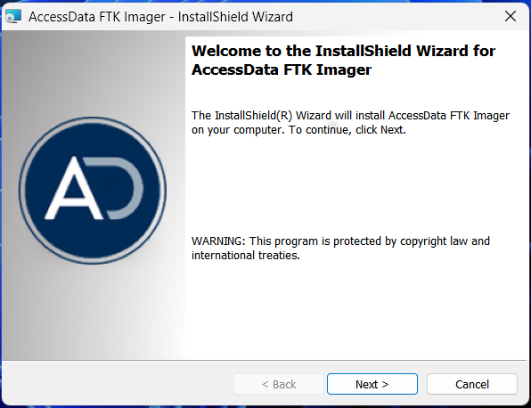
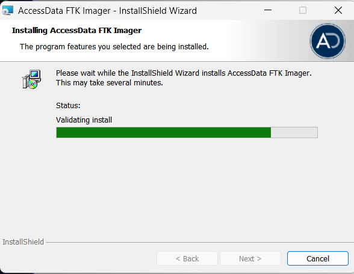
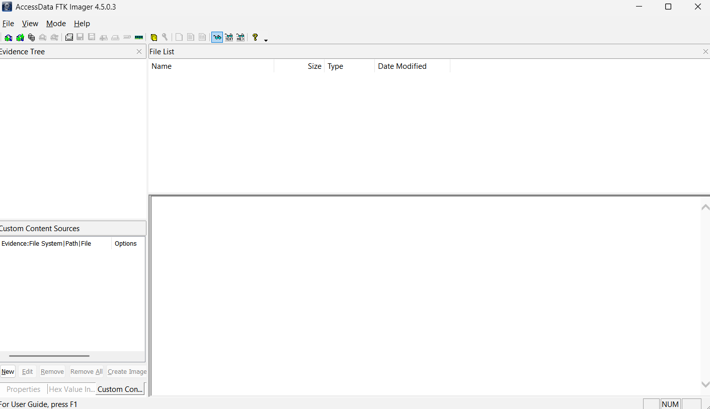
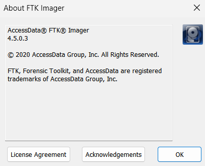

### 6.2 Carga de evidencia y navegación inicial

Se agregó la evidencia del sistema y se ubicaron los hives relevantes para análisis del Registro en contexto de investigación.

Evidencias asociadas:

- `05_add_evidence_item.png`
- `06_unidad_sistema_cargada.png`
- `07_hive_software_ubicado.png`
- `08_hive_software_detalle.png`

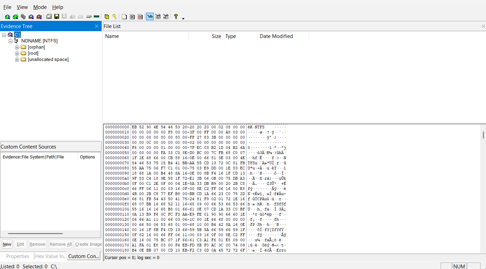
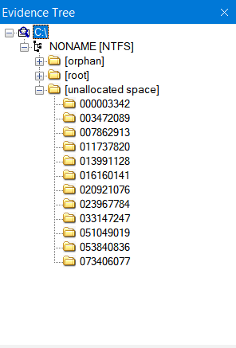
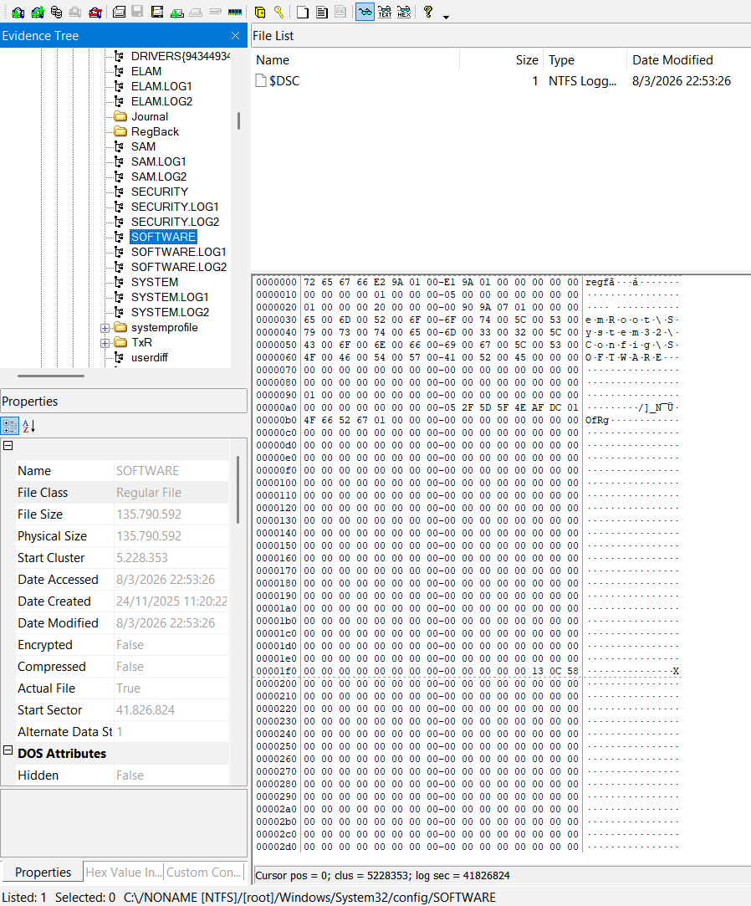
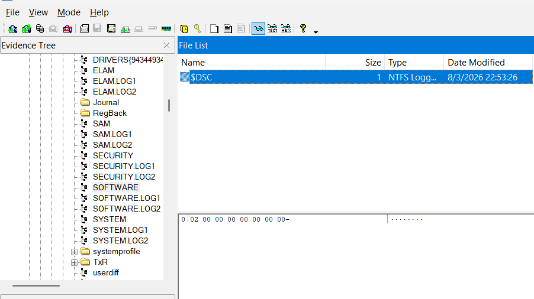

### 6.3 Análisis de Run key (persistencia)

Se analizó la ruta `HKLM\SOFTWARE\Microsoft\Windows\CurrentVersion\Run` para identificar ejecutables configurados al inicio del sistema.

Criterios de observación aplicados:

- Presencia de software legítimo y esperado.
- Identificación de rutas fuera de ubicaciones estándar.
- Detección de nombres de valor ambiguos u ofuscados.

Evidencias asociadas:

- `09_run_key_vista_general.png`
- `10_run_key_valores.png`
- `11_run_key_posible_sospechoso.png`

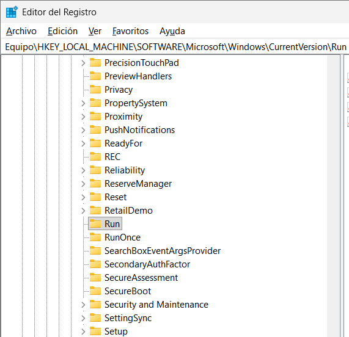
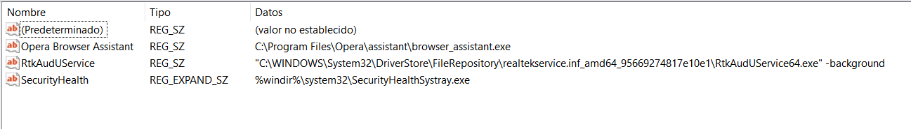
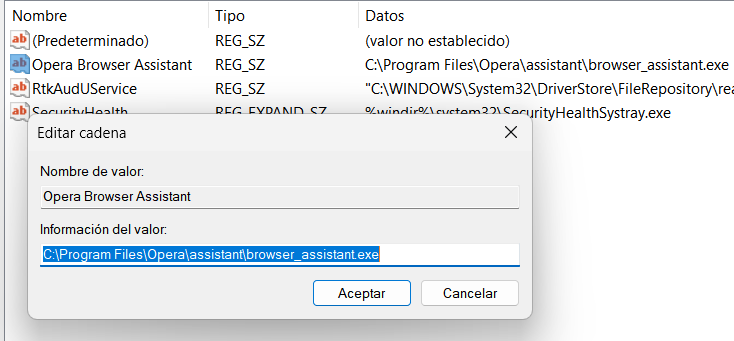

Valores observados en `Run` (confirmados también en `reg/run_key_export.reg`):

- `SecurityHealth` -> `%windir%\system32\SecurityHealthSystray.exe`
- `RtkAudUService` -> `...\RtkAudUService64.exe -background`
- `Opera Browser Assistant` -> `C:\Program Files\Opera\assistant\browser_assistant.exe`

### 6.4 Análisis de RecentDocs (actividad de usuario)

Se examinó la ruta `HKCU\Software\Microsoft\Windows\CurrentVersion\Explorer\RecentDocs` para identificar huellas de acceso a documentos y apoyar reconstrucción de actividad.

Evidencias asociadas:

- `13_recentdocs_vista_general.png`
- `14_recentdocs_listado.png`
- `15_recentdocs_elemento_relevante.png`

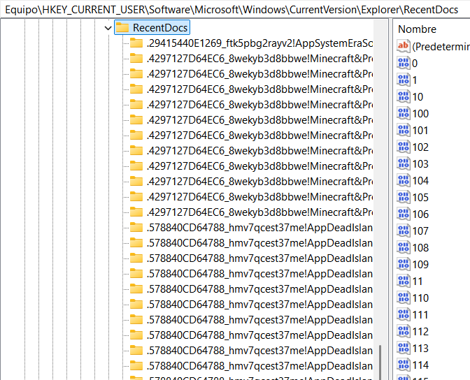
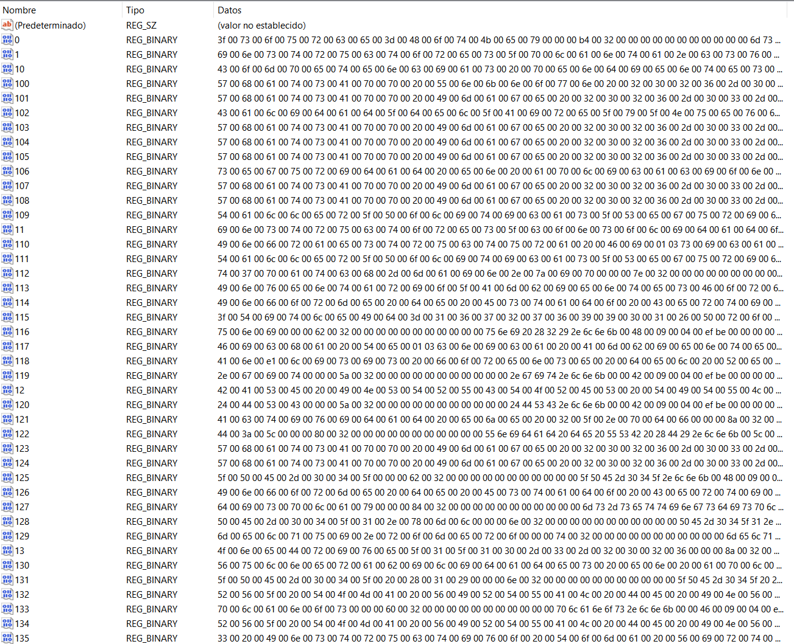
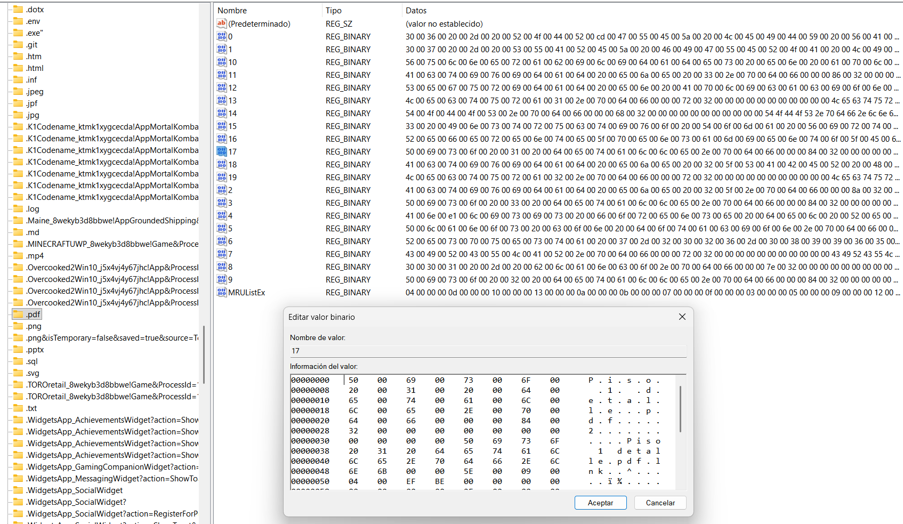

Nota de trazabilidad de captura:

- La evidencia del contexto de usuario se documentó mediante la navegación visible en `13_recentdocs_vista_general.png` y con la exportación efectiva en `reg/recentdocs_export.reg`.

Hallazgos representativos en `RecentDocs` (según captura y exportación):

- Presencia de múltiples entradas binarias con historial reciente (`MRUListEx`).
- Referencia visible a archivo de interés: `Piso detalle.pdf` (captura `15_recentdocs_elemento_relevante.png`).
- Aparición de artefactos recientes de trabajo (por ejemplo `README.md`, `monkey.png`) en la exportación, útiles para reconstrucción de actividad.

### 6.5 Exportación y preservación

Se exportaron artefactos relevantes para preservar evidencia reproducible y facilitar auditoría técnica posterior.

Evidencias asociadas:

- `16_exportacion_run_key.png`
- `17_exportacion_recentdocs.png`

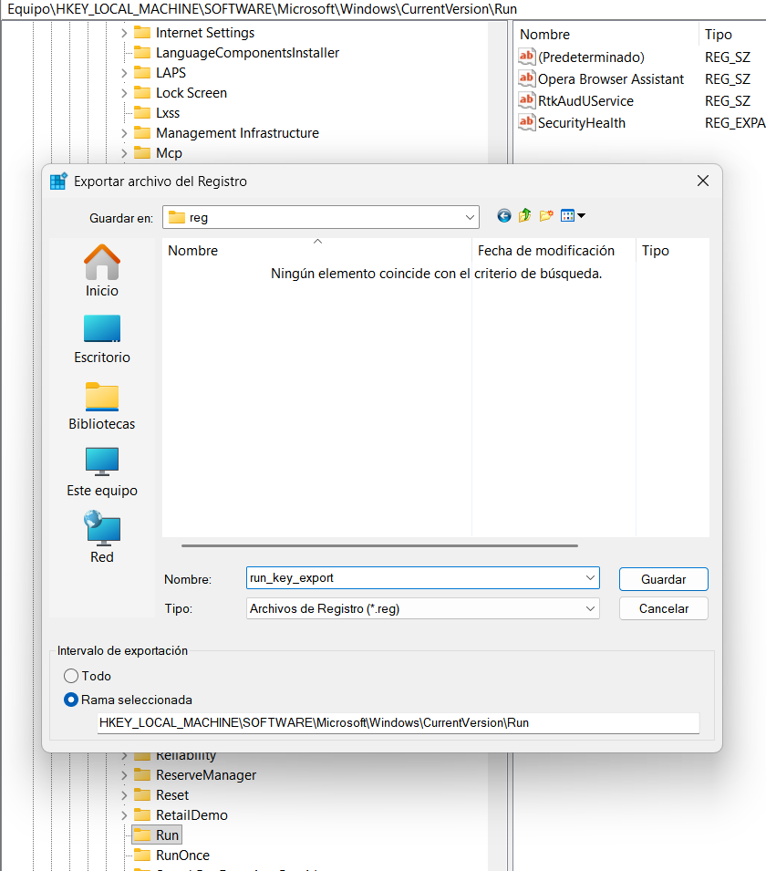
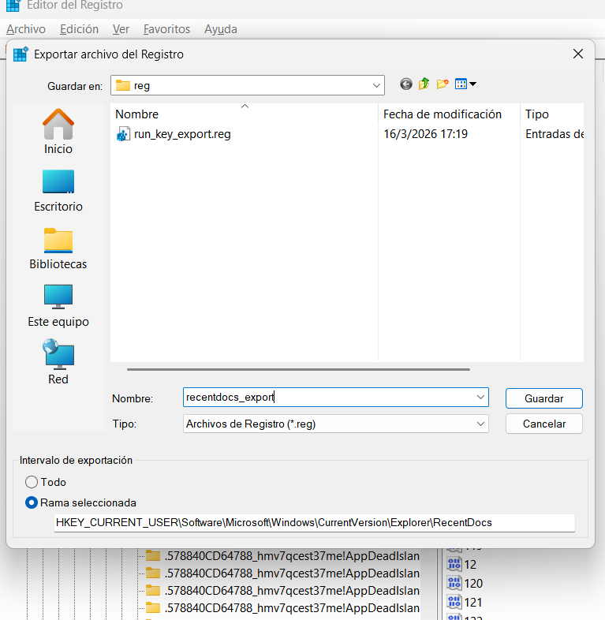

Archivos exportados:

- `reg/run_key_export.reg`
- `reg/recentdocs_export.reg`

---

## 7. Resumen de hallazgos

| Hallazgo | Evidencia | Impacto | Nivel de riesgo |
|---|---|---|---|
| Entradas de inicio automático legítimas en `Run` (`SecurityHealth`, `RtkAudUService`, `Opera Browser Assistant`) | `10_run_key_valores.png`, `reg/run_key_export.reg` | No se observó persistencia claramente maliciosa en el punto de revisión | Bajo-Medio |
| Ruta de tercero en autoarranque (`Opera Browser Assistant`) | `11_run_key_posible_sospechoso.png` | Requiere monitoreo periódico por tratarse de software no nativo del sistema | Medio |
| Alto volumen de entradas recientes en `RecentDocs` | `14_recentdocs_listado.png`, `reg/recentdocs_export.reg` | Permite reconstrucción detallada de actividad de usuario | Medio |
| Evidencia de documento reciente de interés (`Piso detalle.pdf`) | `15_recentdocs_elemento_relevante.png` | Confirma huella de acceso reciente a documento de trabajo y fortalece la línea temporal de uso | Medio |

---

## 8. Análisis e interpretación

La clave `Run` concentra artefactos de persistencia relevantes para la detección temprana de comportamientos anómalos. En esta revisión puntual no se identificaron entradas evidentemente maliciosas; las tres entradas observadas corresponden a componentes esperados del sistema/controlador y a un asistente de navegador de tercero. Aun así, por buenas prácticas forenses, cualquier entrada de terceros en autoarranque debe auditarse periódicamente.

Por su parte, `RecentDocs` permite reconstruir una línea funcional de actividad del usuario. Aunque no prueba por sí sola una acción maliciosa, sí aporta contexto útil para priorizar revisión de archivos sensibles, evaluar hábitos de uso y soportar decisiones de contención o monitoreo adicional. La exportación `recentdocs_export.reg` refuerza esta lectura al conservar las entradas MRU en formato trazable.

La correlación de ambas fuentes mejora la calidad del análisis: persistencia técnica (`Run`) más comportamiento operativo (`RecentDocs`) ofrece una visión más robusta del riesgo.

En lugar de capturas de cierre adicionales (`18`, `19`, `20`), la consolidación de trazabilidad se integró directamente en las secciones de hallazgos y análisis mediante evidencia cruzada entre capturas y exportaciones `.reg`, manteniendo coherencia metodológica para la entrega.

---

## 9. Recomendaciones

1. Implementar listas de permitidos para software de inicio y revisar trimestralmente la clave `Run`.
2. Validar firma digital y reputación de ejecutables de terceros en autoarranque.
3. Mantener respaldo periódico de claves de interés (`Run`, `RecentDocs`) en formato `.reg` para trazabilidad comparativa.
4. Complementar este análisis con revisión de eventos de seguridad para correlación temporal.
5. Fortalecer capacitación de usuarios sobre manejo de documentos sensibles y limpieza segura de rastros operativos.

---

## 10. Conclusiones

El análisis del Registro de Windows con FTK Imager resultó adecuado para identificar artefactos forenses de alto valor en una investigación inicial. Las claves `Run` y `RecentDocs` aportaron evidencia complementaria sobre persistencia y actividad reciente, permitiendo construir hipótesis técnicas fundamentadas en observación directa.

Se concluye que la calidad del resultado forense depende de la trazabilidad integral entre evidencia, análisis e interpretación. En ese sentido, la captura ordenada, la preservación de artefactos y la documentación estructurada son elementos críticos para cumplir con criterios de validez técnica y académica.

Para esta entrega se validó la evidencia visual principal de análisis y se reforzó la consistencia técnica con los archivos `run_key_export.reg` y `recentdocs_export.reg`, integrando trazabilidad cruzada entre capturas, exportaciones y tabla de hallazgos.

Finalmente, la actividad evidencia continuidad metodológica respecto al Eje 1: cambia la fuente de evidencia (logs a Registro), pero se mantiene el rigor del proceso forense y la lógica de reporte profesional.

---

## 11. Bibliografía

- AccessData. *FTK Imager User Guide*.
- NIST. *Guide to Integrating Forensic Techniques into Incident Response*.
- Fundación Universitaria del Área Andina. Referente de pensamiento Eje 3.
- Lectura complementaria de la actividad.
